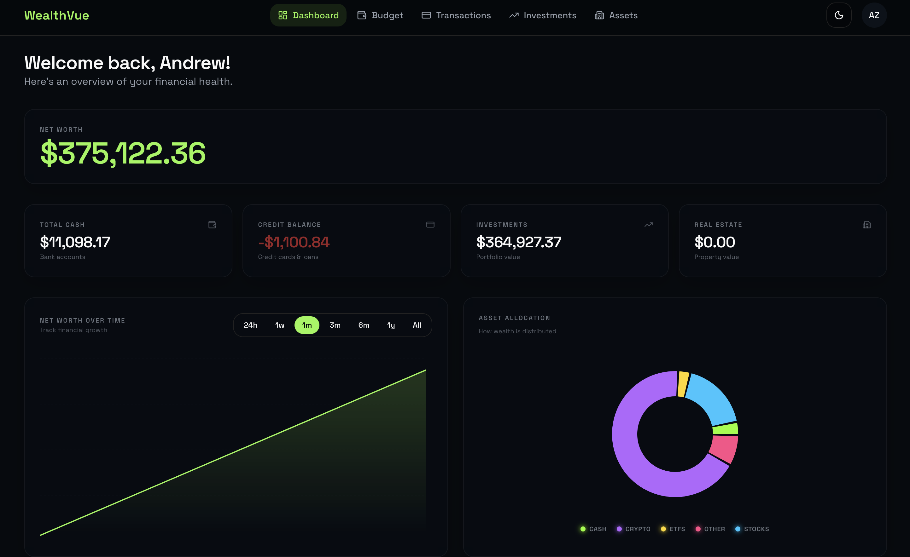
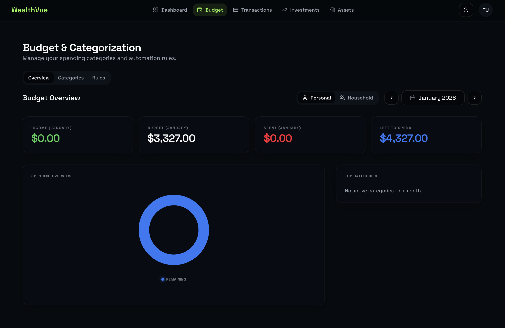

# WealthVue

**Your Complete Financial Picture, Finally in One Place.**

WealthVue is a comprehensive personal financial dashboard that eliminates the fragmentation of managing your money across multiple apps and spreadsheets. Track budgets, investments, and net worth with a single, unified platform that you control.

Stop juggling Mint for budgeting, Personal Capital for investments, and Excel for net worth tracking—WealthVue does it all.

---

## Screenshots
### Dashboard

### Budget Management


## Why WealthVue?

### 🎯 **Unified Financial Management**
Unlike traditional finance apps that focus on just budgeting *or* just investments, WealthVue seamlessly integrates both—along with comprehensive asset tracking—so you see your complete financial picture in one dashboard.

### 🔒 **Privacy-First & Self-Hosted**
Your financial data is sensitive. WealthVue is designed to be self-hosted via Docker, meaning your data stays on your own infrastructure, under your control. No third-party data sharing, no privacy concerns.

### 💎 **Multi-Asset Portfolio Tracking**
Most finance apps only track stocks and bonds. WealthVue supports **stocks, crypto, real estate, precious metals, commodities, and more**—giving sophisticated investors the flexibility they need for modern, diversified portfolios.

### 👨‍👩‍👧‍👦 **Built for Families**
Link accounts with family members to manage household finances together while maintaining independent logins. See combined net worth, shared budgets, and individual spending in one place.

### 🤖 **Smart Automation Without Losing Control**
Automatically sync bank transactions via Plaid, apply intelligent categorization rules, and get real-time portfolio pricing—but retain full manual override for complete flexibility.

---

## What You Can Do with WealthVue

### **📊 Track Your Complete Net Worth**
- See all your assets and liabilities in one comprehensive dashboard
- Monitor net worth changes over time with interactive historical charts
- View asset allocation breakdowns (cash, stocks, crypto, real estate, etc.)
- Get timezone-aware daily snapshots for accurate tracking

### **💰 Master Your Budget**
- Create custom budget categories that match how you actually spend
- Set monthly budgets with flexible carry-over rules (roll unused funds or start fresh)
- Automatically categorize transactions with intelligent rules
- Track spending vs. budget with visual progress indicators

### **📈 Monitor Your Investments**
- Track diverse portfolios: stocks, ETFs, crypto, real estate, precious metals, commodities
- Real-time pricing updates for stocks (Yahoo Finance) and crypto (CoinGecko)
- View dedicated allocation charts for crypto and stock holdings
- Monitor 24h performance and market movers
- Calculate gains/losses and ROI across all asset classes

### **🏦 Sync All Your Accounts**
- Automatic bank transaction syncing via Plaid integration
- Manual transaction entry for cash purchases and non-connected accounts
- CSV import for bulk transaction uploads
- Comprehensive transaction filtering and search

### **🏠 Manage Family Finances**
- Link accounts with family members for household visibility
- Toggle between personal and household views
- Share budgets and track combined net worth
- Maintain separate logins with appropriate privacy controls

---

## Key Benefits

✅ **Stop Context Switching** – One app for budgets, investments, and net worth  
✅ **Own Your Data** – Self-hosted deployment means complete privacy control  
✅ **Track Any Asset** – From stocks to crypto to real estate, all in one portfolio  
✅ **Automate the Boring Stuff** – Smart rules and syncing save hours every month  
✅ **See the Full Picture** – Understand where you stand financially at a glance  
✅ **Plan Together** – Family account linking for household financial management  

---

## Features at a Glance

- ✅ **Automated Transaction Syncing** via Plaid
- ✅ **Manual Transaction Entry** and CSV Import
- ✅ **Custom Budget Categories** with flexible carry-over rules
- ✅ **Intelligent Transaction Categorization** with rule engine
- ✅ **Multi-Asset Investment Tracking** (stocks, crypto, real estate, metals, commodities)
- ✅ **Real-Time Portfolio Pricing** (Yahoo Finance + CoinGecko)
- ✅ **24h Performance Tracking** and market movers
- ✅ **Net Worth Dashboard** with historical snapshots
- ✅ **Interactive Allocation Charts** with hover effects
- ✅ **Family Account Linking** for household finances
- ✅ **Mobile-Optimized** responsive design
- ✅ **Self-Hosted** via Docker Compose

## Tech Stack

- **Frontend**: Next.js 14, React 18, TypeScript, Tailwind CSS, shadcn/ui
- **Backend**: Next.js API Routes, NextAuth.js, Prisma ORM
- **Database**: PostgreSQL 16+
- **Cache/Jobs**: Redis 7+, BullMQ
- **External APIs**: Plaid, Yahoo Finance, CoinGecko

## Project Status

✅ **Phase 4: Dashboard, Net Worth & Family Accounts** - Complete

See [TASKS.md](./TASKS.md) for detailed task breakdown and progress.

## Prerequisites

- Node.js 20+ and pnpm
- Docker and Docker Compose (for local database)
- PostgreSQL 16+
- Redis 7+

## Getting Started

### 1. Install Dependencies

```bash
npm install
```

### 2. Set Up Environment Variables

Copy the example environment file and fill in your values:

```bash
cp .env.example .env
```

Required variables:
- `DATABASE_URL`: PostgreSQL connection string
- `REDIS_URL`: Redis connection string
- `NEXTAUTH_URL`: Your application URL (http://localhost:3000 for local)
- `NEXTAUTH_SECRET`: Generate with `openssl rand -base64 32`
- `PLAID_CLIENT_ID`: Plaid API client ID
- `PLAID_SECRET`: Plaid API secret
- `PLAID_ENV`: Plaid environment (sandbox/development/production)

### 3. Set Up Database

Run database migrations:

```bash
npx prisma migrate dev
```

### 4. Start Development Server

```bash
npm run dev
```

Open [http://localhost:3000](http://localhost:3000) in your browser.

## Project Structure

```
wealthvue/
├── .agents/plans/       # Feature implementation plans
├── reference/           # Technical documentation
├── src/
│   ├── app/            # Next.js App Router (pages, layouts, API routes)
│   ├── components/     # React components
│   │   └── ui/         # shadcn/ui components
│   ├── lib/            # Business logic and utilities
│   │   ├── auth/       # Authentication logic
│   │   ├── db/         # Database client and repositories
│   │   ├── jobs/       # Background jobs (BullMQ)
│   │   ├── services/   # Business logic services
│   │   ├── integrations/ # External API clients
│   │   └── utils/      # Helper functions
│   └── types/          # TypeScript type definitions
├── prisma/             # Database schema and migrations
├── docker/             # Docker configuration
├── PRD.md              # Product Requirements Document
├── TASKS.md            # Master task checklist
└── CLAUDE.md           # AI assistant instructions
```

## Available Scripts

```bash
npm run dev          # Start development server
npm run build        # Build for production
npm run start        # Start production server
npm run lint         # Run ESLint
npm run format       # Format code with Prettier
npm run format:check # Check code formatting
npm run type-check   # Run TypeScript type checking
```

## Prisma Commands

```bash
npx prisma studio          # Open Prisma Studio (database GUI)
npx prisma generate        # Generate Prisma Client
npx prisma migrate dev     # Create and apply migrations (dev)
npx prisma migrate deploy  # Apply migrations (production)
```

## Documentation

- [PRD.md](./PRD.md) - Complete product requirements
- [TASKS.md](./TASKS.md) - Task breakdown for all MVP phases
- [reference/technical-architecture.md](./reference/technical-architecture.md) - System architecture
- [reference/database-schema.md](./reference/database-schema.md) - Database design
- [CLAUDE.md](./CLAUDE.md) / [GEMINI.md](./GEMINI.md) - AI assistant workflows

## Development Workflow

1. Review [TASKS.md](./TASKS.md) for upcoming tasks
2. Create feature plan in `.agents/plans/` (for complex features)
3. Implement feature following architecture patterns
4. Update [TASKS.md](./TASKS.md) as tasks complete
5. Run tests and ensure type safety

## Production Deployment (Systemd)

For running WealthVue on a Linux server without Docker, you can use systemd to manage the application and worker processes.

### Setup

Run the automated setup script to build the app, run migrations, and install the services:

```bash
sudo ./scripts/setup-services.sh
```

### Management

```bash
# Update the application
sudo ./update.sh

# Check status
systemctl status wealthvue
systemctl status wealthvue-worker

# View logs
journalctl -u wealthvue -f
journalctl -u wealthvue-worker -f

# Restart services
sudo systemctl restart wealthvue wealthvue-worker
```

## Docker Deployment

To run the entire stack using Docker Compose:

1. Copy `.env.example` to `.env` and fill in the required values.
2. Run `docker-compose up -d`.
3. The application will be available at `http://localhost:3000`.

Note: Make sure to set `DATABASE_URL` to `postgresql://wealthvue:${DB_PASSWORD:-wealthvue_dev_password}@postgres:5432/wealthvue?schema=public` in your `.env` file to connect to the Docker Postgres instance.

## Contributing

This is a personal project, but suggestions and feedback are welcome via GitHub issues.

## License

MIT License - see [LICENSE](LICENSE) for details.

---

**Current Phase**: MVP Release (v1.0.0)
**Last Major Update**: Pre-release Housekeeping & Cleanup
**Next Phase**: Community Feedback & Feature Expansion

See [TASKS.md](./TASKS.md) for detailed progress tracking.
